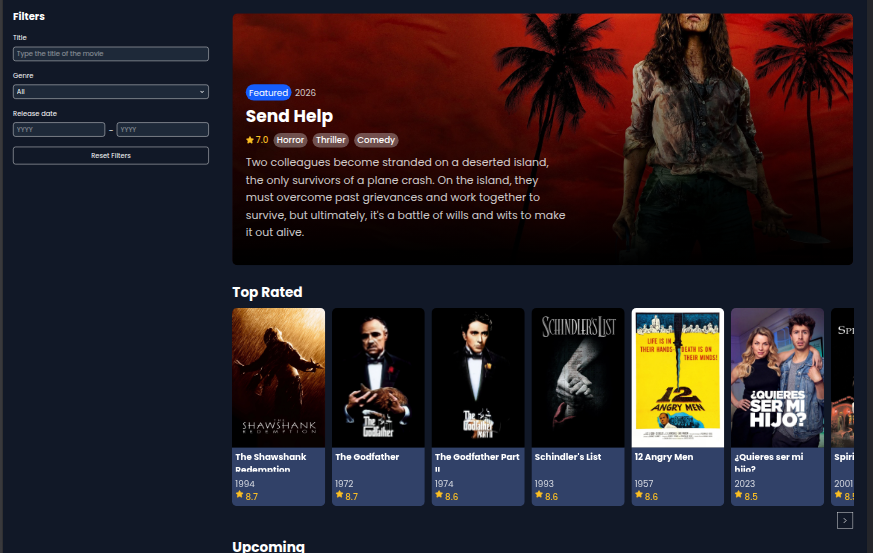
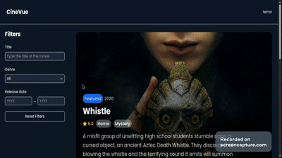

# 🎬 Cine Vue

Aplicação web para explorar filmes utilizando a API do TMDB, desenvolvida com Vue e foco em experiência do usuário e arquitetura de frontend.

---

## 🚀 Features

- 🔎 Busca de filmes por título
- 🎭 Filtros por gênero e ano
- ⭐ Listas de filmes:
  - Top Rated
  - Upcoming
- 🔄 Paginação com padrão **Load More**
- 🎯 Atualização dinâmica sem reload da página

---

## 🧠 Destaque Técnico

Uma das principais features do projeto é a implementação de um padrão de paginação moderno:

### 🔄 Load More Pagination

- Substitui paginação tradicional e infinite scroll
- Botão "Load More" como último item do carrossel
- Novos filmes são adicionados sem perder posição
- Controle de estado por categoria
- Oculta automaticamente quando não há mais páginas disponíveis

---

## ⚙️ Tecnologias

- Vue 3
- TypeScript
- TailwindCSS
- TMDB API

---

## 🧩 Arquitetura

O projeto utiliza separação clara entre:

- 📡 Camada de API (requisições)
- 🧠 Estado da aplicação (categorias e paginação)
- 🎨 Componentes reutilizáveis

### Destaques:

- Estado derivado (`hasMorePages`)
- Controle de loading por categoria
- Reset de paginação ao aplicar filtros
- Reutilização de lógica entre diferentes listas de filmes

---

## 🌐 Live Demo

Acesse a aplicação online:

👉 https://cine-vue-coral.vercel.app/

---

## 📸 Preview

### 🎬 Home

### 🔄 Load More

## 👨‍💻 Autor

Desenvolvido por [Ezequiel Otoni](https://www.linkedin.com/in/zeotoni/)